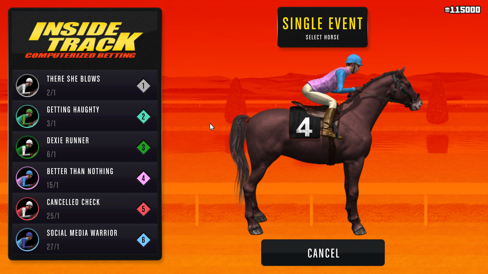

# GTA-Online-Autobet

[](https://github.com/MarkusJx/GTA-Online-Autobet/releases/latest)
[](https://github.com/MarkusJx/GTA-Online-Autobet/releases/latest)

A simple GTA Online horseracing-autobetting-bot

[Open project website](https://markusjx.github.io/autobet/)

Table of contents
=================

<!--ts-->
   * [Usage](#usage)
   * [Demonstration](#demonstration)
   * [Compiling yourself](#Compiling-yourself)
     * [Prerequisites](#prerequisites)
     * [Electron installation](#electron-installation)
     * [Compile](#Compile)
        * [Compile AI](#Compile-AI)
        * [Compile Autobet](#Compile-Autobet)
   * [Feedback](#feedback)
     * [Not what you expected?](#this-is-not-what-you-expected)
     * [Like it?](#like-it)
   * **[Download](#download)**
<!--te-->


## Usage

* For this to work, you need at least **100.000** chips in-Game.
* Navigate on the betting computers to the betting screen


(This one)

* Press the 'start' button on the UI (a countdown will start, giving you time to head back into the game) or use the Key combination ```CTRL+SHIFT+F10```. You can also use that combo to stop the program from doing its thing. Using the combo ```CTRL+SHIFT+F9``` you can always kill the program instantly. **Just make sure the game is your active (selected) window (you should basically be able to move the cursor in-Game on the betting screen)**

* After starting, the script will automatically bet, refresh the screens and earn about 300k - 500k per hour (more like ~250k after patch 1.50). Fully AFK. **Please don't move your mouse after the script has started, otherwise it will stop working and you'd have to restart the script.** This is a fail safe mechanism so it won't do any damage if the mouse for some reason doesn't move as expected. Be aware that Rockstar Games might ban you and will ban you after making a lot of money (about 10 - 20 mil) for a week from betting.

BTW, this script does **not** use any glitches or inject code into the game. Just plain taking-over-your-mouse-action.
**Keep in mind that there's no guarantee that Rockstar will not ban you for using this script**.
It is pretty unlikely for them to do so but it might happen.

If this is not enough for you, there are methods to make more money and [videos explaining how to do so](https://youtu.be/dQw4w9WgXcQ?t=43).

And nobody cares about your screen resolution, you just have to follow the steps described above. You can also use windowed mode. And the minimum (supported) resolution is 720p. Plus a 16:9 aspect ratio is required.
If your screen does not support it, play the game in windowed mode rather than fullscreen mode

### Demonstration

**[Demonstration video](https://youtu.be/dQw4w9WgXcQ)** if there is something not clear by now

## Compiling yourself

Stranger Danger. You've heard this right? Yeah, No. Me neither. But if you don't trust your shady software dealer in the back corner of the github software party, that's totally fine. To compile it yourself, take a look at the [wiki pages](https://github.com/MarkusJx/autobet/wiki/Compiling-(Pre-v1.2.0)).

## Feedback
### This is not what you expected?
Well, I'm not amazon or similar, so I can't give you a refund on a already free product, but if you don't like it, uninstalling is free.

If something does not work on the other hand, feel free to leave a Github issue in the [issues section](https://github.com/MarkusJx/GTA-Online-Autobet/issues), it's free. But make sure to include at least a description of the error and a log file. This can be created when starting the program through command line with the flag ```--debug```

You can also create a full debugging zip with the included debug.bat, which can be found at
```C:\Users\{Username}\AppData\Local\Programs\GTA Online Autobet\```

**Important notices on the debugging zip**
* This will create a autobet_debug.zip file on your desktop
* It will include screenshots, **make sure to hide any personal/sensitive data or to delete screenshots from the .zip showing these information**
* If no out.log is included, it will be located at the program's install location
* You can send this .zip in

Chances of getting a response are somewhat high, so just give it a try. Again, it's free.

### Like it?
Since there is not way to show if you like software... Good for you.

### Love it?
Great to hear!

### Live it?
No, you don't.

# Download

Pick the newest version under the [Releases](https://github.com/MarkusJx/GTA-Online-Autobet/releases/latest) section.

Installing the program may also be a great Idea.
