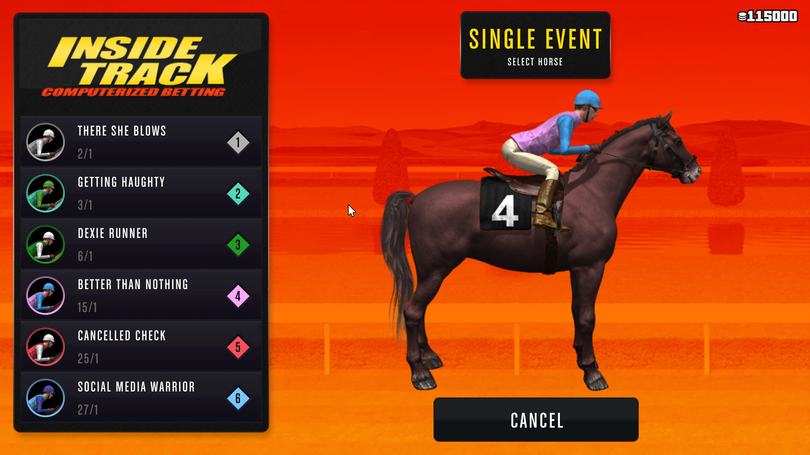

# GTA-Online-Autobet

This folder contains the old python versions <= 0.x[.x] of GTA-Online-Autobet, which are deprecated now. Following the old README.md for those versions

Table of contents
=================

<!--ts-->
   * [Usage](#usage)
   * [Compiling yourself](#trust-issues)
     * [Prerequisites](#prerequisites)
     * [Electron installation](#electron-installation)
     * [Python part](#python-part)
   * [Feedback](#feedback)
     * [Not what you expected?](#this-is-not-what-you-expected)
     * [Like it?](#like-it)
   * **[Download](#download)**
<!--te-->


## Usage

* For this to work, you need at least **100.000** chips in-Game.
* Navigate on the betting computers to the betting screen


(This one)

* Press the 'start' button on the UI (a countdown will start, giving you time to head back into the game) or use the Key combination ```CTRL+SHIFT+F10```. You can also use that combo to stop the program from doing its thing. Using the combo ```CTRL+SHIFT+F9``` you can always kill the program instantly. **Just make sure the game is your active (selected) window (you should basically be able to move the cursor in-Game on the betting screen)**

* After starting, the script will automatically bet, refresh the screens and earn about 300k - 500k per hour. Fully AFK. **Please don't move your mouse after the script has started, otherwise it will stop working and you'd have to restart the script.** This is a fail safe mechanism so it won't do any damage if the mouse for some reason doesn't move as expected. Be aware that Rockstar Games might ban you and will ban you after making a lot of money (about 10 - 20 mil) for a week from betting.

BTW, this script does **not** use any glitches or inject code into the game. Just plain taking-over-your-mouse-action.
**Keep in mind that there's no guarantee that Rockstar will not ban you for using this script**.
It is pretty unlikely for them to do so but it might happen.

And nobody cares about your screen resolution or if you are playing in windowed or fullscreen mode, you just have to follow the steps described above

## Trust issues

Stranger Danger. You've heard this right? Yeah, No. Me neither. But if you don't trust your shady software dealer in the back corner of the github software party, that's totally fine. So here are the steps to compile this whole thing yourself:

### Prerequisites

* [Node.js](https://nodejs.org/en/) version 12.14.0 or later
* [Python](https://www.python.org/downloads/) version 3.7.0 or later (using [Anaconda](https://www.anaconda.com/distribution/) version   3.7 or later is actually recommended)

*Perform the following steps in a command line with git and npm enabled*
* Clone this repository ``git clone https://github.com/MarkusJx/GTA-Online-Autobet``
* Change directory to the just cloned one ``cd GTA-Online-Autobet``

#### Electron installation
* Install electron ``npm i -D electron@latest``
* Clone the electron-quick-start repo ``git clone https://github.com/electron/electron-quick-start``
* Copy the contents of the electron folder into the electron-quick-start folder ``cp -R electron/. electron-quick-start``
* Copy the contents of the electron-quick-start folder into the electron folder ``cp -R electron-quick-start/. electron``
* Cd into the electron folder ``cd electron``
* Install the electron prerequisites ``npm install``
* Install electron packager ``npm install electron-packager``
* Change directory back to the main directory ``cd ..``
* Create the electron package ``electron-packager electron``

#### Python part
* Install the python part requirements ``pip3 install -r requirements.txt``
* Create the winnings exe ``pyinstaller -y -w  "winnings.py"`` (You can also use auto-py-to-exe, which is installed with installing the requirements)
* Start the main file ``python autobet.py``
* **OR** Compile the autobet exe ``pyinstaller -y -w --hidden-import bottle_websocket  "autobet.py"`` (Again, you could use auto-py-to-exe) and copy the following files and folders into the resulting folder: *models, winnings, ui, web, electron-win32-x64* and create a new folder named 'eel' in the autobet folder and copy the eel.js file from your python installation into it. You can now start the program by clicking on the autobet.exe file

## Feedback
### This is not what you expected?
Well, I'm not amazon or similar, so I can't give you a refund on a already free product, but if you don't like it, uninstalling is free.

If something does not work on the other hand, feel free to leave a Github issue in the [issues section](https://github.com/MarkusJx/GTA-Online-Autobet/issues), it's free. But make sure to include at least a description of the error and a log file, which can be found at 
```
C:\Users\{Username}\AppData\Local\Programs\GTA Online Autobet\output.log
```

Chances of getting a response are somewhat high, so just give it a try. Again, it's free.

### Like it?
Since there is not way to show if you like software... Good for you.

### Love it?
Great to hear!

### Live it?
No, you don't.

# Download

Pick the newest version under the [Releases](https://github.com/MarkusJx/GTA-Online-Autobet/releases/latest) section.

Installing the program may also be a great Idea.
